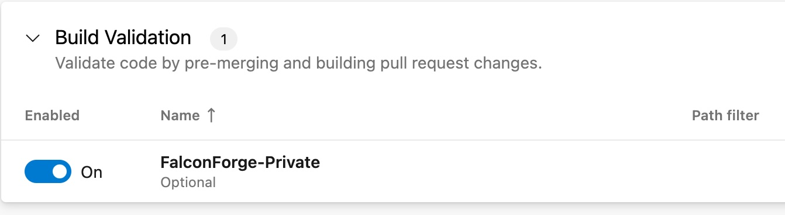
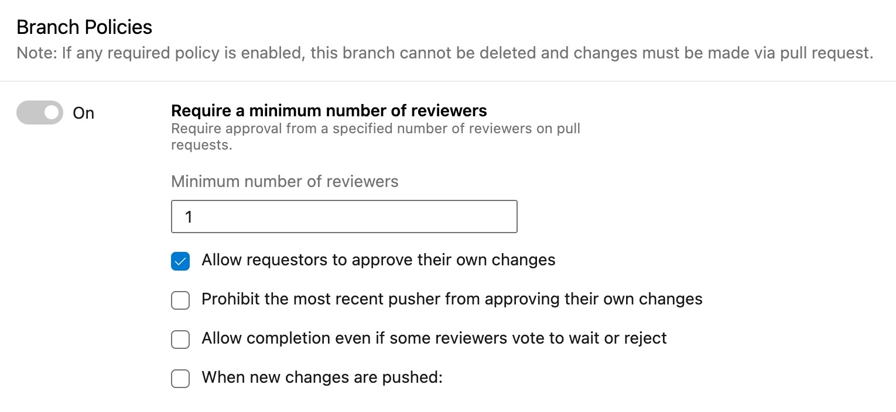

# Introduction

This pipeline can be imported into Azure Devops and used to automatically verify the syntax of the use-case files in the repository.

It is recommended to configure two policies in the repository on the main branch:

Setup a build validation policy:

Setup branch policy to disallow direct pushing to the main branch but require a pull request:

